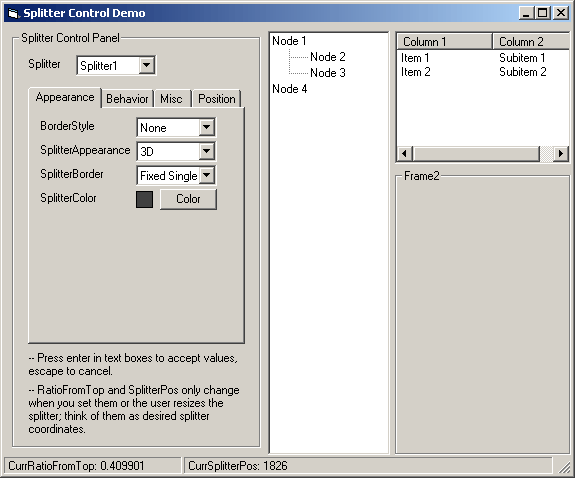



## Splitter Control 1\.1\.9

### Description

 

Splitter Control is a Windows Explorer style splitter. To use it, add controls to it the same way you do for a frame, and set the Child1 and/or Child2 properties to the names of the added controls. 

 

Features 

- Live and non-live updating while child controls are resized 

- Customize appearance of splitter bar while not live updating 

- Escape can be pressed while moving splitter bar to cancel the move 

- Specify a maximum size for a child control 

- Specify a minimum size for either child control 

- Horizontal or vertical orientation 

- Position splitter bar by percentage or absolute position 
 
### More Info
 
This is an OCX, the same as other VB components. Right-click on the toolbox to add this component to your project.

             |
---                |---
**Submitted On**   |2001-10-16 09:13:24
**By**             |[Tim Humphrey](https://github.com/Planet-Source-Code/PSCIndex/blob/master/ByAuthor/tim-humphrey.md)
**Level**          |Intermediate
**User Rating**    |4.9 (102 globes from 21 users)
**Compatibility**  |VB 5\.0, VB 6\.0
**Category**       |[Custom Controls/ Forms/  Menus](https://github.com/Planet-Source-Code/PSCIndex/blob/master/ByCategory/custom-controls-forms-menus__1-4.md)
**World**          |[Visual Basic](https://github.com/Planet-Source-Code/PSCIndex/blob/master/ByWorld/visual-basic.md)
**Archive File**   |[Splitter C2931110162001\.zip](https://github.com/Planet-Source-Code/tim-humphrey-splitter-control-1-1-9__1-21763/archive/master.zip)

